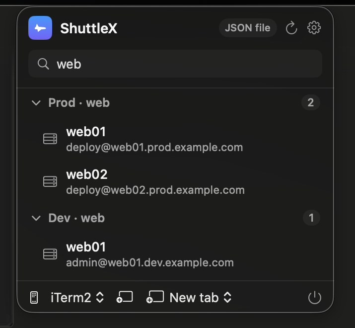
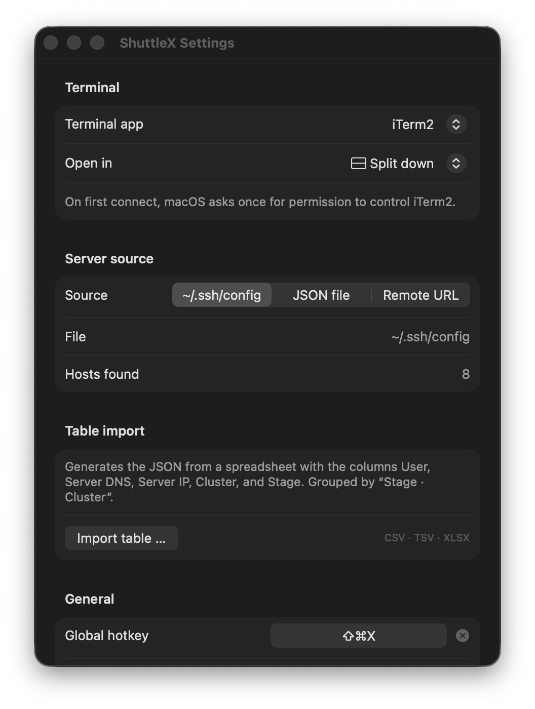

# ShuttleX

A modern SSH launcher for the macOS menu bar — inspired by the original [SSHMenu](https://sshmenu.sourceforge.net) and by [Shuttle](https://github.com/fitztrev/shuttle), rebuilt with SwiftUI (`MenuBarExtra`, `@Observable`). Pure **arm64** binary for Apple Silicon, not a universal app.

<p align="center">
  
  &nbsp;
  
</p>

📖 Full documentation is in the [**Wiki**](https://github.com/DasDuo/ShuttleX/wiki) · version history in the [**Changelog**](CHANGELOG.md).

## Features

- Lives entirely in the menu bar (no Dock icon); a modern dropdown panel with a search field, hover effects, and **collapsible groups** (collapsed by default, click to expand; matches expand automatically while searching)
- **Switchable server source** (Settings → Server source):
  - `~/.ssh/config` — hosts are read directly (including `Include` directives; wildcard hosts like `*` are ignored)
  - JSON file at `~/.config/shuttlex/servers.json` (created with sample entries the first time you switch to it). The path is configurable in Settings, and the last 3 versions are kept as backups next to the file (`servers.backup-…json`) on every change — manual or imported
- **Add, edit and delete servers in-app** (JSON source) — manage your connection list from a GUI in Settings → "Add / edit servers…", no hand-editing of JSON required
- **Choose your terminal app**: Terminal, iTerm2, Ghostty, Warp, Alacritty, kitty, WezTerm — only apps that are actually installed are offered (also switchable right in the dropdown footer)
- **Choose how it opens** (dropdown footer or Settings): new window, new tab, or split pane — depending on what the terminal app supports:
  - iTerm2: window, tab, split right, split down
  - Terminal.app: window, tab (tab needs the Accessibility permission once, see Notes)
  - Ghostty, Warp, Alacritty, kitty, WezTerm: new windows only (can't be steered otherwise from outside; unsupported modes fall back to "new window" automatically)
  - When the terminal isn't running yet, a new window is always opened — tab/split only apply once a window exists
- Search + Enter connects straight to the first match
- Optional: launch at login (Settings → General)
- **Optional update check** (off by default): enable it in Settings to get a hint in the menu when a newer release is on GitHub — it checks the public Releases API at most once a day (no account, no tracking) and links to the download; it never auto-installs

## Download

### Homebrew

```sh
brew install --cask dasduo/tap/shuttlex
```

Updates then come via `brew upgrade --cask shuttlex`.

### Direct download

Grab the latest from the [Releases](https://github.com/DasDuo/ShuttleX/releases) page:

- **`ShuttleX-<version>-arm64.dmg`** — open it and drag **ShuttleX** onto the **Applications** shortcut.
- `ShuttleX-<version>-arm64.zip` — unzip and move the app to `/Applications`.

However you install it, approve the app **once** on first launch — it's ad-hoc signed, not notarized, so Gatekeeper blocks it the first time:

```sh
xattr -dr com.apple.quarantine /Applications/ShuttleX.app
```

(or System Settings → Privacy & Security → "Open Anyway"). Step-by-step install and troubleshooting: the [**Installation**](https://github.com/DasDuo/ShuttleX/wiki/Installation) wiki page.

Releases are produced automatically: push a tag (`git tag vX.Y.Z && git push origin vX.Y.Z`) and GitHub Actions builds and publishes the `.dmg` and `.zip`, and bumps the Homebrew cask. Maintainers: see [RELEASING.md](RELEASING.md).

## Build & run

```sh
./build.sh
open build/ShuttleX.app
```

Requirements: an Apple Silicon Mac, Xcode (or the Command Line Tools) with Swift 5.9+, macOS 14+.

For "launch at login" to work reliably, copy the app to `/Applications` after building:

```sh
cp -R build/ShuttleX.app /Applications/
```

Run the test suite (CSV/XLSX parsing, JSON merge, backup rotation, shell-quoting / import safety) with:

```sh
swift test
```

## Table import (CSV / Excel / Google Sheets)

ShuttleX can generate the JSON directly from a spreadsheet — handy when you manage many servers. Settings → **Table import → "Import table …"**.

Expected columns (order doesn't matter; the header row is detected automatically, and German/English names are recognized):

| User | Server DNS | Server IP | Cluster | Stage |
|------|-----------|-----------|---------|-------|
| deploy | web01.prod.example.com | 10.0.1.11 | web | Prod |

- **Format**: CSV, TSV, or Excel (`.xlsx`). The `,` and `;` delimiters are auto-detected. Google Sheets: just export as CSV or Excel (File → Download).
- **IP or DNS**: before importing you choose whether the connection target is the DNS name or the IP address (if the chosen value is missing, it falls back to the other).
- **Name**: the "Server DNS" (or "Name") column is used verbatim as the display name in the menu — it doesn't have to be a real DNS. You can pick the IP as the connection target independently.
- **Grouping**: one group is created per combination as `Stage · Cluster` (e.g. "Prod · web") — keeping the menu tidy.
- **Mode**: *Merge* updates entries with the same name and adds new ones (manually maintained servers are preserved); *Replace* overwrites the JSON file completely.
- **Safety**: rows whose server fields contain unsafe characters (spaces or shell symbols) are skipped, and all connection targets are shell-quoted when the `ssh` command is built — so importing an untrusted spreadsheet can't inject shell commands.

A sample file lives at [`examples/servers-sample.csv`](examples/servers-sample.csv).

## JSON format

`~/.config/shuttlex/servers.json`:

```json
{
  "groups": [
    {
      "name": "Production",
      "hosts": [
        { "name": "Web server", "user": "root", "host": "web1.example.com" },
        { "name": "Database", "user": "admin", "host": "db.example.com", "port": 2222 },
        { "name": "Via jump host", "command": "ssh -J jump.example.com root@10.0.0.5" }
      ]
    }
  ],
  "hosts": [
    { "name": "Ungrouped", "host": "example.org" }
  ]
}
```

- `host`/`user`/`port` are assembled into `ssh user@host -p port`
- `command` allows arbitrary custom commands (jump hosts, tunnels, mosh, …)
- top-level `hosts` end up in a group called "Server"

## Distributing to another Mac

Besides the app bundle, `./build.sh` produces `ShuttleX-<version>-arm64.zip`, and `./make-dmg.sh` packages a drag-to-install `ShuttleX-<version>-arm64.dmg`. Copy either to the target Mac and install the app to `/Applications`.

Because the app is only ad-hoc signed (not notarized), Gatekeeper blocks the first launch when the file arrives via the internet/AirDrop. There are two ways to approve it:

1. **Via Terminal** (simplest): remove the quarantine attribute, after which the app starts normally:
   ```sh
   xattr -dr com.apple.quarantine /Applications/ShuttleX.app
   ```
2. **Via System Settings**: launch the app once (dismiss the warning), then click **"Open Anyway"** under *System Settings → Privacy & Security*. (Since macOS 15, right-click → Open is no longer enough.)

If the app arrives on a FAT/exFAT-formatted USB stick, no quarantine attribute is set and it starts right away.

Distributing without this hurdle would require a **Developer ID signature + notarization** (Apple Developer account, $99/year). With an account: `codesign --sign "Developer ID Application: …" --options runtime` followed by `xcrun notarytool submit`.

## Notes

- For Terminal.app and iTerm2, macOS asks once on first connect for permission ("ShuttleX wants to control Terminal") — this is required for AppleScript and must be allowed.
- The "new tab" mode in Terminal.app works via a simulated Cmd+T keystroke (Terminal.app offers no AppleScript API for it). For this, ShuttleX must be allowed under System Settings → Privacy & Security → Accessibility. iTerm2 doesn't need this — there tabs and splits go straight through the AppleScript API.
- Splits open in the currently active iTerm2 window; with no window open, a new one is created instead (same behavior for tabs).
- Ghostty, Alacritty, kitty, and WezTerm are launched via command-line arguments; Warp via a launch configuration (`warp://launch/…`).
- The app is ad-hoc signed (local build). Distributing to other Macs would require a Developer ID signature + notarization.

## Credits & inspiration

ShuttleX stands on the shoulders of two projects:

- [**SSHMenu**](https://sshmenu.sourceforge.net) — the original GNOME panel applet that kept all your SSH connections one click away: grouped, opening a terminal, with your choice of terminal. ShuttleX is essentially that idea, modernized for the macOS menu bar.
- [**Shuttle**](https://github.com/fitztrev/shuttle) — the macOS take that popularized the menu-bar + `~/.ssh/config` approach.

The design choices follow from this lineage: a menu-bar dropdown (not a windowed app), `~/.ssh/config` as a first-class source, grouped one-click connections, and a configurable terminal — plus modern additions like search, collapsible groups, table import, version backups, and in-app server management.

The app icon is based on a space-shuttle vector from [Pixabay](https://pixabay.com/vectors/space-shuttle-nasa-rocket-spaceflight-294104/) (Pixabay Content License), recolored and composited.

## License

[MIT](LICENSE)
